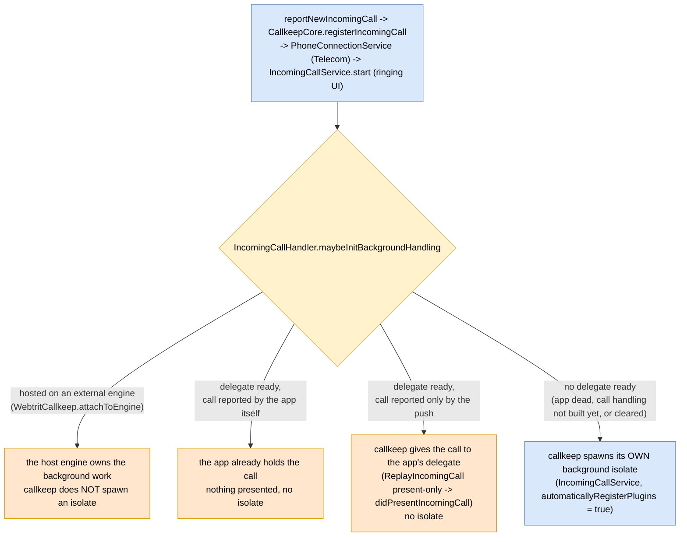
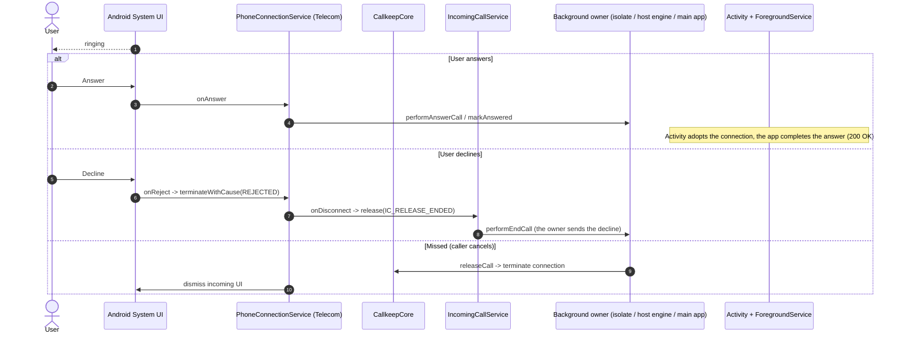

# Incoming call handling (decision + outcomes)

How callkeep decides who runs the background work for an incoming call, and the terminal outcomes
it drives. callkeep is transport-agnostic: it does not know whether a call arrives via push, a
persistent socket, or in-app signaling. The integrator reports the call; callkeep presents it via
Android Telecom and routes call control.

Related: step-by-step flows in [call-flows.md](call-flows.md); services in
[background-services.md](background-services.md) and [foreground-service.md](foreground-service.md);
hosting callkeep on an app-owned engine in
[../../docs/external-flutter-engines.md](../../docs/external-flutter-engines.md).

Color: blue = callkeep, orange = host app, grey = external (Telecom / system UI), yellow = decision.

## Who owns the background work

After a call is reported and `IncomingCallService` starts, `IncomingCallHandler.maybeInitBackgroundHandling`
decides whether callkeep spawns its own background isolate:

One rule, the same as on iOS, where a call PushKit registered is reported to the app: a call
the push registered goes to the app's delegate when one is ready, and to a push isolate otherwise.
The Activity lifecycle plays no part. A visible or recently backgrounded Activity says nothing
about who will take the call - the app closes its socket when a call ends in the background, and
the OS may close it too. Until this rule, a call arriving while the app lived in the background
without a socket skipped the isolate on the strength of the lifecycle alone, was owned by nobody
and rang on after the caller hung up. Given the call through the same `ReplayIncomingCall` path a
freshly attached delegate is seeded by, the app holds it and reconnects to learn whether it still
rings; a call the server no longer has is ended by the handshake.

What the gate reads:

- **Delegate ready** - `ForegroundService.isDelegateReady`, set by `onDelegateSet` and cleared by
  `onDelegateCleared` (`setDelegate(null)`) and the service's `onDestroy`. A bound service is not
  enough: the app's call handling may not be built yet, and a presentation would wait unread.
  Without a ready delegate the isolate runs and the app takes the call over through the usual
  handoff when its delegate attaches.
- **Reported by the app** - `CallkeepCore.isReportedByApp(callId)`: the foreground bridge reported
  the call itself, so the app holds it and it is not presented back. The core sets the fact when
  the bridge registers the call and clears it when the call terminates - which covers a refused
  report, the app's own end report and a transfer-back that reuses the id.
- **Present-only** - the hand-over confirms no handoff: no push session ran, and a handoff
  release would end the ringing phase of a call nobody has answered; the service's notification is
  the app's call UI while it is in the background. Answer and end still release it as before.

## Terminal outcomes

The owner that reported the call drives the outcome; callkeep mediates through Telecom and
`IncomingCallService`. The owner is the callkeep isolate, the host engine, or the main app
(see the decision above).

