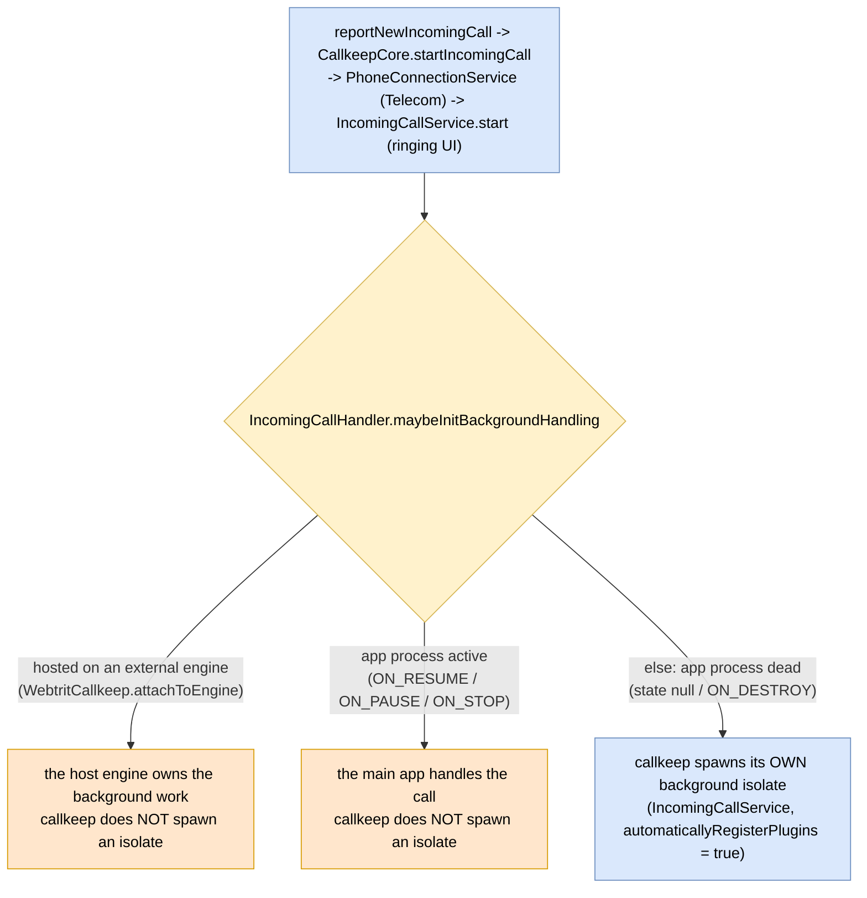
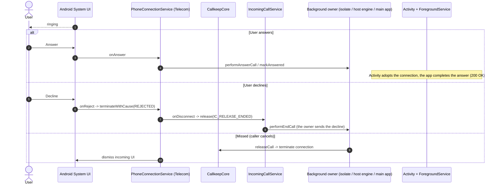

# Incoming call handling (decision + outcomes)

How callkeep decides who runs the background work for an incoming call, and the terminal outcomes
it drives. callkeep is transport-agnostic: it does not know whether a call arrives via push, a
persistent socket, or in-app signaling. The integrator reports the call; callkeep presents it via
Android Telecom and routes call control.

Related: step-by-step flows in [call-flows.md](call-flows.md); services in
[background-services.md](background-services.md) and [foreground-service.md](foreground-service.md);
hosting callkeep on an app-owned engine in
[../../docs/external-flutter-engines.md](../../docs/external-flutter-engines.md).

Color: blue = callkeep, orange = host app, grey = external (Telecom / system UI), yellow = decision.

## Who owns the background work

After a call is reported and `IncomingCallService` starts, `IncomingCallHandler.maybeInitBackgroundHandling`
decides whether callkeep spawns its own background isolate:

## Terminal outcomes

The owner that reported the call drives the outcome; callkeep mediates through Telecom and
`IncomingCallService`. The owner is the callkeep isolate, the host engine, or the main app
(see the decision above).

