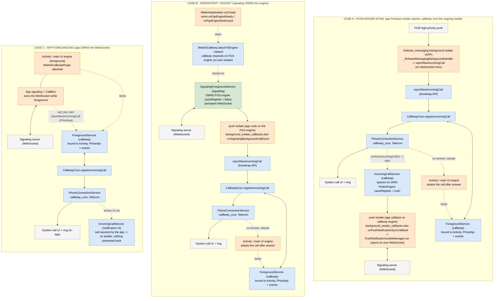
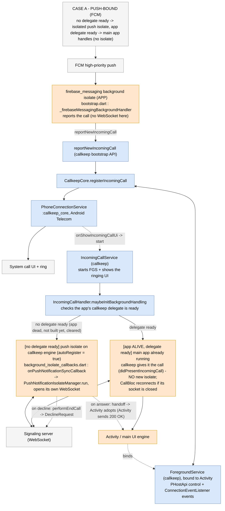
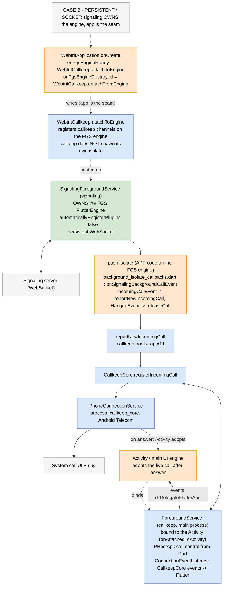
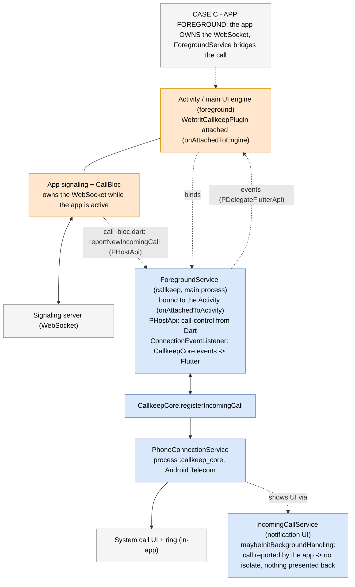
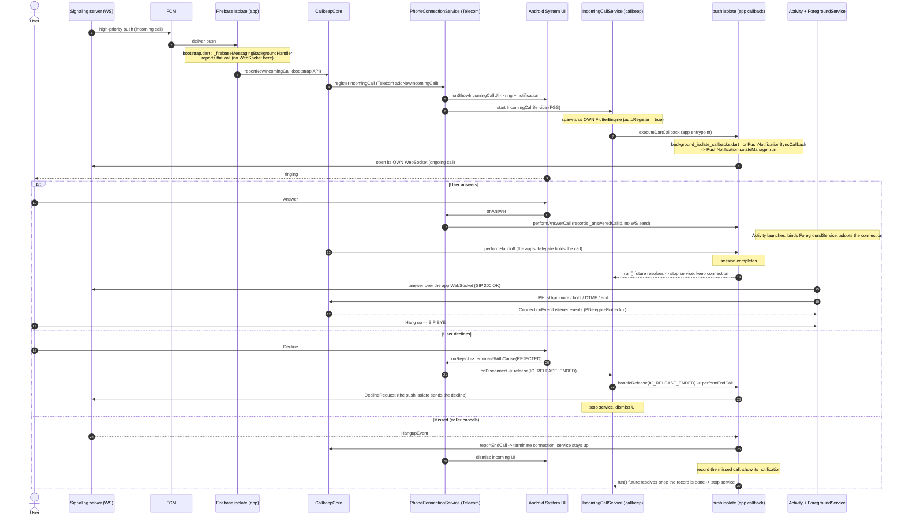
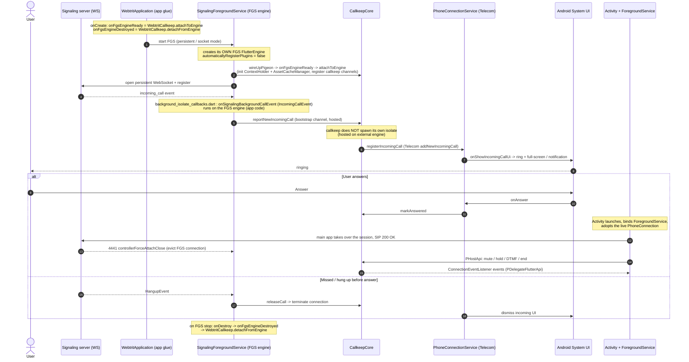

# Incoming-call background scenarios

How an incoming call is delivered and handled depending on the app state and the configured mode.
The single decision that selects the owner of the background work lives in callkeep
(`IncomingCallHandler.maybeInitBackgroundHandling`); see the callkeep doc
`webtrit_callkeep_android/docs/incoming-call-handling.md`. This page shows the app-level scenarios.

GitHub renders the `mermaid` blocks below.

Colour legend:

- blue — `webtrit_callkeep`
- green — `signaling_service`
- orange — `webtrit_phone` (app code, incl. app callbacks running on a callkeep / FGS engine)
- grey — external (FCM, signaling server / WebSocket, Android Telecom / system UI)

## All scenarios (combined)

## Case A — push-bound (FCM)

The call goes to the main app when its callkeep delegate is ready, and to a push isolate
otherwise - the Activity lifecycle does not decide. callkeep gives the app the call
(`didPresentIncomingCall`) rather than only skipping the isolate: the app may have closed its
socket when the previous call ended in the background, and holding the call is what makes
`CallBloc.onChange` reconnect - the handshake then delivers the offer or ends a call the server no
longer has.

## Case B — persistent / socket

Signaling owns the engine; the app is the seam (`WebtritCallkeep.attachToEngine`).

## Case C — app foreground

The app owns the WebSocket; `ForegroundService` bridges the call.

## A second call while one rings (Android)

Telecom lets one incoming call ring at a time and refuses the next one. What happens to a call
reported while another incoming call rings is set by
`CallkeepAndroidOptions.incomingCallWhileRinging`; the app passes nothing, so the default,
`queue`, applies. Callkeep side:
`webtrit_callkeep_android/docs/call-flows.md` and `callkeep-core.md` (Waiting calls).

With `queue` the second call (B) waits in callkeep's queue instead of reaching Telecom. The app
is not told: `reportNewIncomingCall` succeeds, and CallBloc holds B as an ordinary incoming
call - with the app open it is listed next to the ringing call (A) with its own answer and
decline. Outside the app B has a silent "Call waiting" notification with two actions.

| What happens | Callkeep | What the user sees |
|---|---|---|
| B is reported while A rings | B waits, silent notification posted | both calls in the app; "Call waiting" in the shade |
| A ends (caller hung up, declined) | B is registered with Telecom | B rings like any incoming call |
| A is answered | B is registered beside A at once | B rings as call waiting on top of A |
| Answer on B (notification or app) | A is declined, B goes through and is answered | the call screen on B |
| Decline current (notification) | A is declined, the oldest waiting call goes through | B rings |
| B's caller hangs up while it waits | B leaves the queue, Telecom never sees it | a missed call |
| The app declines B while it waits | B leaves the queue, `performEndCall(B)` | B is declined on the server |

With `reject` nothing waits: Telecom refuses B, `reportNewIncomingCall` returns
`callRejectedBySystem`, and CallBloc declines B on the server (the caller hears 603 Decline).

## Sequence — Case A (push-bound): answer / decline / missed

The push session belongs to the call it was opened for (the one `IncomingCallService` shows).
Its WebSocket sees every line of the account, so it can also hear about other calls - a second
incoming call that Telecom refused while this one rings. A `HangupEvent` for such a call ends
that call natively - and records it as a missed call, under its own caller, only if the session
saw that call's `IncomingCallEvent` - but does not end the session: ending it there handed the
session's own call off while it still rang, which took its notification away and left its
connection ringing with nobody to hear its hangup. The handshake is read for every incoming line
for the same reason - the session's own call is not necessarily on line 0. If the handshake no
longer lists the session's own call, that call ended before the session opened: the session
ends it and closes instead of waiting for a hangup that will not come.

The session's end is the completion of `onPushNotificationSyncCallback`'s future, and the plugin
stops `IncomingCallService` on it - the session never stops the service itself. The future is
draining, not stopping: every missed-call record the session started (its own call's or another
call's) finishes before it resolves, whatever ended the session, so the record is written while
the service still holds its rights. `releaseCall` stays only for a call the session never saw.

What ends the session is its own call ending here, or callkeep's `performHandoff`: the app's
delegate has taken the call (or another handler ended it). The Activity's WebSocket displacing
the session's (4441 `controllerForceAttachClose`) is not a handoff - it only moves the server's
events to the Activity, which reports a hangup of its own accord - and the session keeps the
service up through it. On a Samsung M32 cold start that gap between the Activity's socket and
its delegate was 8.8 s; a caller hanging up inside it used to come back as a ghost call.

The last stretch of that gap is covered on the Dart side, in callkeep: a hangup `CallBloc` hears
for a call it does not hold is reported as `missedWhileConnecting`, and `Callkeep` records that
id before the report crosses to the platform (on the M32 the replay got through the main looper
3 s before it). The delegate callkeep hands the platform drops `didPresentIncomingCall` for a
recorded id, and the bloc asks `Callkeep.wasEndedBeforePresented` after its contact lookup
before it shows a presentation it received earlier. The bloc keeps no list of its own.

## Sequence — Case B (persistent / socket)

> Caveat: the answer branch (Activity takeover, 200 OK, 4441 eviction) is the *intended* path,
> reconstructed from the documented 4441 / handoff mechanism. `onSignalingBackgroundCallEvent`
> itself only handles `IncomingCallEvent` (report) and `HangupEvent` (release); the persistent
> answer is the WT-1538 area.

